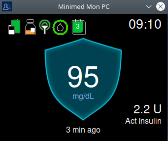

# Carelink Python Client
*Medtronic CareLink Client implemented in Python*

- [Carelink Python Client](#carelink-python-client)
  - [Note](#note)
  - [Supported devices](#supported-devices)
  - [Features](#features)
  - [Limitations](#limitations)
  - [Requirements](#requirements)
  - [How to use](#how-to-use)
    - [Clone this repository](#clone-this-repository)
    - [Install dependencies](#install-dependencies)
    - [Get login data](#get-login-data)
    - [Download pump and sensor data](#download-pump-and-sensor-data)
      - [Using the CLI tool](#using-the-cli-tool)
      - [Using the library](#using-the-library)
      - [Using the proxy tool](#using-the-proxy-tool)
        - [Systemd service](#systemd-service)
        - [Data GUI](#data-gui)
  - [Credits](#credits)
  - [Disclaimer](#disclaimer)


Python library, which can be used for retrieving data from Medtronic CareLink of online CGM and insulin pump device data uploads (Guardian Connect, MiniMed 7xxG). 


## Note

This is a developer version. Works for me. Extensive testing of different use cases is needed. Please report back if it works also or you.


## Supported devices

- [Medtronic MiniMed 780G pump](https://www.medtronic-diabetes.co.uk/insulin-pump-therapy/minimed-780g-system)

- [~~Medtronic Guardian Connect CGM~~](https://www.medtronicdiabetes.com/products/guardian-connect-continuous-glucose-monitoring-system)
  
- [Medtronic MiniMed 770G pump](https://www.medtronicdiabetes.com/products/minimed-770g-insulin-pump-system) 
  - not tested, but should be working


## Features

- Works with Carelink patient and follower account
- Automatic refresh of access token 
- Local storage of token data
- Function for downloading current pump and sensor status plus last 24h data from CareLink Cloud
- CareLink Client CLI (console example program)
- CareLink Client Proxy (daemon example program for providing the CareLink data in the local network)


## Limitations

- CareLink MFA is not supported


## Requirements

- Patient or Care Partner account (same as for the [CareLink Connect app](https://play.google.com/store/apps/details?id=com.medtronic.diabetes.carepartner&hl=en_US&gl=US))
  - in case of a Care Partner account: successful pairing with the Patient's account ([see more info](https://www.medtronicdiabetes.com/customer-support/minimed-780g-system-support/setting-up-carelink-connect-app))
  
- Runtime: Python3 and some libraries


## How to use

### Clone this repository

```
git clone https://github.com/ondrej1024/carelink-python-client.git
cd carelink-python-client
```

### Install dependencies
```
pip3 install -r requirements.txt
```

### Get login data

The Carelink Client library needs the initial login data stored in the `logindata.json` file. This file is created by running the login script on a PC with a screen.

The script opens a Firefox web browser with the Carelink login page. You have to provide your Carelink patients or follower credentials and solve the reCapcha. On successful completion of the login the data file will be created. 

```
python3 carelink_carepartner_api_login.py 
```

*Note*: you need to add the `--us` option to this command if you have a US Carelink account.

The Carelink Client reads this file from the local folder and it will take care of refreshing automatically the login data when it expires. It should be able to do so within one week of the last refresh.

### Download pump and sensor data

#### Using the CLI tool

`carelink_client2_cli.py` is an example Python application which uses the `carelink_client2` library to download the patients Carelink data to a file via the command line. 
Use the `-h` option for more info. Basic usage:
```
python3 carelink_client2_cli.py --data
```


#### Using the library

`carelink_client2.py` is a Python module that can be used in your own Python application. Basic usage:

```python
import carelink_client2

client = carelink_client2.CareLinkClient(tokenFile="logindata.json")
if client.init():
    client.printUserInfo()
    recentData = client.getRecentData()
```

#### Using the proxy tool

`carelink_client2_proxy.py` is a Python application which uses the `carelink_client2` library. It runs as a service and downloads the patients Carelink data periodically and provide it via a simple REST API to clients in the local network.
Use the `-h` option for more info. Basic usage:

```
python3 carelink_client2_proxy.py
```

The proxy provides the following API endpoints which can be queried with an HTTP `GET` request:

* `<proxy IP address>:8081` (Status info)
* `<proxy IP address>:8081/carelink` (complete data, in json format)
* `<proxy IP address>:8081/carelink/nohistory` (only current data without last 24h history, in json format)

For documentation of the data format see [doc/carelink-data.ods](doc/carelink-data.ods)


##### Systemd service

To run the proxy automatically at system start it can be installed as systemd service using the provided service file: 
- [systemd/carelink2-proxy.service](systemd/carelink2-proxy.service)

Make sure to double check the script's path inside the service file.

##### Data GUI

To view the Carelink data provided in the local network by `carelink_client2_proxy.py` you can use the [M5 Minimed Monitor](https://github.com/ondrej1024/m5-minimed-monitor)




## Credits

This project is based on other peoples work which I want to thank for their efforts.

* [Pal Marci](https://github.com/palmarci) for reversing the Carelink Cloud API communication of the "Carelink Connect" app

* [Bence Szász](https://github.com/benceszasz) for the Java implementation of the [xDrip Carelink Follower](https://github.com/NightscoutFoundation/xDrip/tree/master/app/src/main/java/com/eveningoutpost/dexdrip/cgm/carelinkfollow)

  

## Disclaimer

This project is intended for educational and informational purposes only. It relies on a series of fragile components and assumptions, any of which may break at any time. It is not FDA approved and should not be used to make medical decisions. It is neither affiliated with nor endorsed by Medtronic, and may violate their Terms of Service. Use of this code is without warranty or formal support of any kind.
